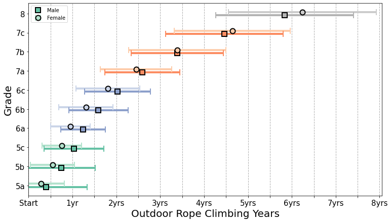
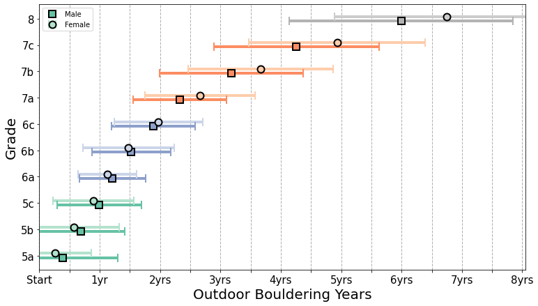
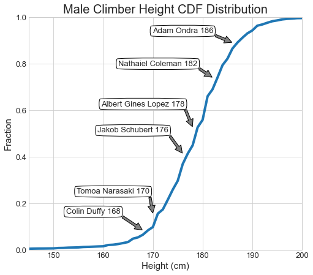
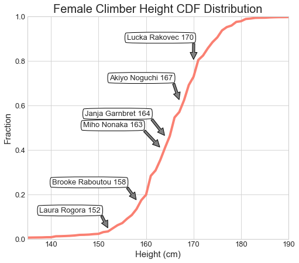

# Aaalyze the world's largest rock climbing logbook
This is a fun analysis, which aims to make discussions about some common questions almost every climber has, from a statistical data point of view. 

First of all, we wonder how well we can climb and how long it would take. Then, influenced by our different heights, we may have different climbing styles, which we can also learn from elite athletes of different heights. Finally, let's take a look at some popular climbing destinations and start planning for the next holiday :climbing: :partying_face: 

## Overview of the data
The data can be accessed on kaggle "[8a.nu Climbing Logbook](https://www.kaggle.com/dcohen21/8anu-climbing-logbook)", and the data was collected by web-scraping [8a.nu website](https://www.8a.nu/), where there it has the world's largest climbing online communities that climbers using it to keep their ascents recorded.

The data is provided in SQLite database, collected on Sep 13, 2017. It includes 4 tabular data with information regarding users, their ascents record, grades, type of climbing, body indexes, personal information, etc.

## Dependencies/Libraries:
Coding in Python3 in Jupyter Notebook IDE, the following libraries are expected: 
* sqlite3
* Numpy
* pandas
* Matplotlib
* Seaborn
* scipy.stats

## Data analysis
### Q1: How long before I can climb on my first 6a, 7a or 8+?

### Q2: How is my height compared with most climbers?

### Q3: Where are the popular climbing places?
The top 3 countries where the most rope climbing routes had been sent are in Spain, USA, and France in order. Same ranking, but for bouldering, are USA, France, and Spain respectively.

Here list some 'hot' climbing destinations.
* Hot crags for rope climbing: Rodellar	in Spain, [xxx] in the United States, Céüse in France, and Kalymnos	in Greece. And actually, Kalymnos is the most popular single crag although Greece ranks 7th in the ranking above. 
* Hot crags for bouldering: Bishop in the United States, Fontainbleau (the most popular on the website) in France, and Albarracín in Spain. 

## Documentation:
The analysis is used to make the plots seen in the Medium Article "".   
The code is put in `ClimbingLogbook_Analyses.ipynb`, or easy reading on nbviewer [here](https://nbviewer.org/github/yduh/climberStat/blob/main/ClimbingLogbook_Analyses.ipynb).

## References:
* How long before you get "Good" as bouldering, [kaggle kernel](https://www.kaggle.com/aarontrefler/how-long-before-you-get-good-at-bouldering), by Aaron Trefler
* Plotting progression times per grade, [kaggle kernel](https://www.kaggle.com/durand1/plotting-progression-times-per-grade), by Durand D'souza
* Climber-characteristic-analysis, [gitHub repo](https://github.com/stevebachmeier/climber-characteristic-analysis), by stevebachmeier
